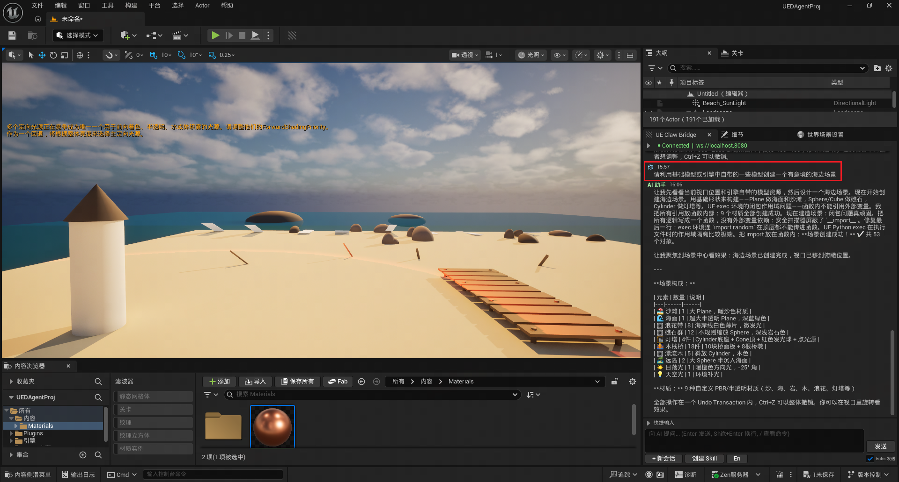
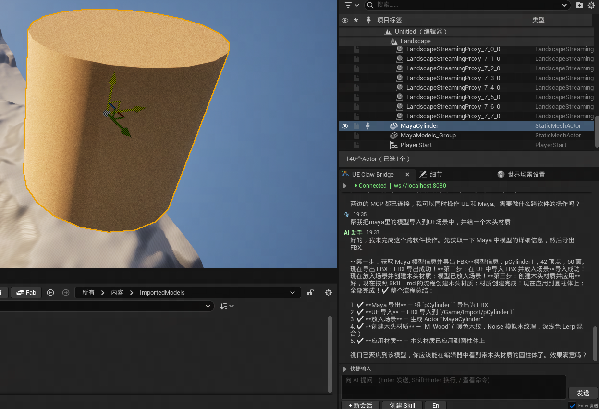
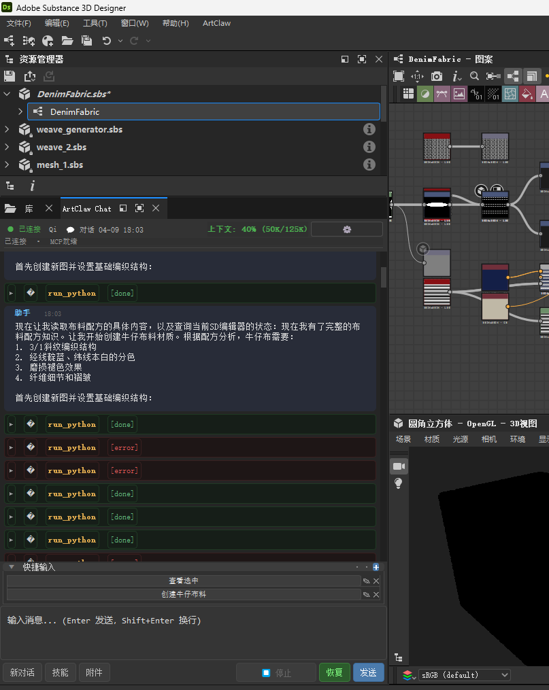
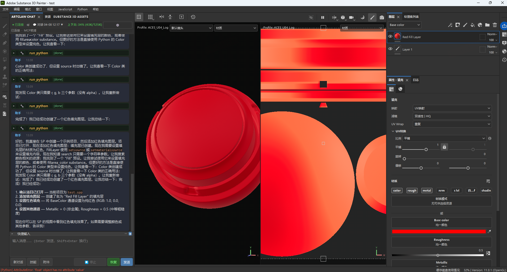

# ArtClaw Bridge

**Bridge DCC tools (UE, Maya, 3ds Max, Blender, Houdini, Substance Painter/Designer, ComfyUI) to AI Agents via MCP Protocol**

ArtClaw Bridge provides a unified AI bridging layer for Digital Content Creation (DCC) software including Unreal Engine, Maya, 3ds Max, Blender, Houdini, Substance Painter, Substance Designer, and ComfyUI. Through the [MCP (Model Context Protocol)](https://modelcontextprotocol.io/), AI Agents can directly understand and operate the editor environment.


[中文文档](README_zh.md)

---

## 🎬 Demo

> Real operation demos showing AI Agent executing tasks directly in the editor

**UE Connection to OpenClaw — AI Chat Panel in Editor**



**Blender Integration — AI Operating in Blender Editor**


**Cross-DCC Pipeline — AI-Driven Workflow**



**Substance Designer & Painter — AI Texture Generation Workflow**




**Tool Manager — Web Skill、Tool Manager**


⭐ *More demo videos coming soon!*

---

## Project Vision

Create a unified framework bridging software and AI Agents, integrating AI capabilities into the entire game development art pipeline, and empowering Agents to operate software and solve upstream/downstream handoff problems.

The benefit of bridging is **the ability to connect various software and Agent platforms in the future**, forming a universal software-Agent interaction layer.

---

## ✨ Core Features

### 🔗 Unified MCP Protocol
All DCC software communicates with AI Agents through the standard MCP protocol. Each DCC exposes only one MCP tool (`run_ue_python` / `run_python`), and AI completes all operations by executing Python code — minimal yet powerful.

### 💬 In-Editor AI Chat Panel
Chat directly with AI in UE / Maya / Max / Blender / Houdini / SP / SD / ComfyUI editors without switching windows. Features:
- **Streaming Output** — AI responses display in real-time with Markdown rendering
- **Tool Call Visualization** — Collapsible cards showing tool name, parameters, and execution results
- **Attachment Support** — Drag and drop images or files for AI to analyze automatically
- **Context Length Display** — Real-time token usage percentage
- **Stop Button** — Interrupt AI execution anytime (sends `chat.abort` to terminate Agent)

### 🛠️ Skill Management System
Layered Skill hot-reloading system, shared across DCCs:
- **Four-Level Priority** — Official > Marketplace > User > Temporary, higher levels override lower ones
- **In-Editor Management Panel** — Unified UI for both UE + DCC, supports filter/search/enable/disable/pin
- **Full Lifecycle** — Install, uninstall, update, publish (version increment + git commit), one-click full sync
- **AI-Generated Skills** — Describe requirements in natural language, AI auto-generates executable Skills (manifest + code + docs)
- **Change Detection** — Auto-detects unpublished changes at runtime, intelligently distinguishes "update" vs "publish" direction
- **Pinned Skills Context Injection** — Pinned Skill docs automatically injected into AI's first message context

### 🌐 Multi-Agent Platform Support
Configuration-driven platform abstraction layer — new platforms automatically appear in UI when registered in config:
- **OpenClaw** — Primary platform, integrated via mcp-bridge plugin
- **LobsterAI (Youdao)** — OpenClaw repackaged, Gateway port 18790
- **Claude Desktop** — stdio→WebSocket bridge POC
- **Hot-Swap in Editor** — One-click platform switch in Settings panel, auto disconnect/reconnect/refresh Agent list

### 🔄 Multi-Session & Agent Management
- **Multi-Agent Switching** — Select Agent in settings panel, toolbar shows current Agent info
- **Session List Management** — Create/switch/delete conversations, each Agent has independent session cache
- **Session Persistence** — Auto-recover last session after UE restart, DCC saves session state in real-time

### 🧠 Memory Management System v2
Three-tier progressive memory model — AI remembers user preferences and operation history:
- **Short-term** (4h / 200 entries) → **Medium-term** (7d / 500 entries) → **Long-term** (permanent / 1000 entries)
- Semantic tag classification (facts/preferences/norms/operations/crashes/patterns)
- Auto-promotion, deduplication, scheduled maintenance
- Operation history tracking and querying

### 📚 Local Knowledge Base (RAG)
Index API docs and project docs, semantic retrieval assists AI decision-making.

### 🛡️ Security & Stability
- Transaction protection, risk assessment, main-thread scheduling
- Shared module sync verification (`verify_sync.py` compares MD5, prevents multi-copy drift)
- Long-task timeout protection + active event reset

---

## 🎯 Supported Engines, DCCs & Agent Platforms

Currently verified with **OpenClaw + LobsterAI + Unreal Engine 5.7 + Maya 2023 + Blender 5.1 + Substance Painter 11.0.1 + Substance Designer 12.1.0 + ComfyUI**. Other combinations are theoretically compatible but not tested — community feedback welcome.

### Engines & DCC Software

| Software | Verified Version | Status | Plugin | MCP Port | Notes |
|----------|-----------------|--------|--------|----------|-------|
| **Unreal Engine** | 5.7 | ✅ Verified | UEClawBridge | 8080 | C++ + Python, Slate UI chat panel |
| **Maya** | 2023 | ✅ Verified | DCCClawBridge | 8081 | Python 3.9.7 + PySide2, Qt chat panel |
| **3ds Max** | — | ⚠️ Not Verified | DCCClawBridge | 8082 | Code implemented, shares plugin with Maya, not tested |
| **Blender** | 5.1 | ✅ Verified | DCCClawBridge | 8083 | PySide6 standalone Qt window, bpy.app.timers driven |
| **Houdini** | — | ⚠️ Not Verified | DCCClawBridge | 8084 | Code implemented, hdefereval main-thread scheduling, not tested |
| **Substance Painter** | 11.0.1 | ✅ Verified | DCCClawBridge | 8085 | SP built-in Qt + QTimer polling |
| **Substance Designer** | 12.1.0 | ✅ Verified | DCCClawBridge | 8086 | SD built-in Qt + QTimer polling, pre-injected sd.api vars |
| **ComfyUI** | V0.19.0 | ✅ Verified | ComfyUIClawBridge | 8087 | Custom node, Python-only, WS MCP Server, no visible nodes |
| **Other UE / Maya Versions** | — | ⚠️ Not Verified | — | — | Theoretically compatible with UE 5.3+ / Maya 2022+, not tested |

### Agent Platforms

| Platform | Status | Notes |
|----------|--------|-------|
| **OpenClaw** | ✅ Verified | Primary dev platform, integrated via mcp-bridge plugin, all features verified here |
| **LobsterAI (Youdao)** | ✅ Verified | OpenClaw repackaged, Gateway port 18790, basic features verified |
| **Claude Desktop** | ⚠️ POC | stdio→WebSocket bridge proof of concept, not deeply integrated |

---

## 🛠️ Official Skills (47 Total)

### Universal Skills (5)
- **artclaw-knowledge** — Project knowledge base queries
- **artclaw-memory** — Memory management operations
- **artclaw-skill-manage** — Skill management operations
- **artclaw-tool-creator** — AI-guided tool creation
- **artclaw-tool-executor** — Tool execution dispatcher

### Unreal Engine Skills (6)
- **ue57-artclaw-context** — Editor context queries
- **ue57-artclaw-highlight** — Viewport highlighting
- **ue57-camera-transform** — Camera operations
- **ue57-operation-rules** — UE operation guidelines
- **ue57_get_material_nodes** — Material node queries
- **ue57_material_node_edit** — Material node editing

### Maya Skills (1)
- **maya-operation-rules** — Maya operation guidelines

### Blender Skills (4)
- **blender-context** — Editor context queries
- **blender-material-ops** — Material & node operations
- **blender-operation-rules** — Blender operation guidelines
- **blender-viewport-capture** — Viewport screenshot

### 3ds Max Skills (1)
- **max-operation-rules** — Max operation guidelines

### Houdini Skills (4)
- **houdini-context** — Editor context queries
- **houdini-node-ops** — Node operations
- **houdini-operation-rules** — Houdini operation guidelines
- **houdini-simulation** — Simulation operations

### Substance Painter Skills (4)
- **sp-context** — Editor context queries
- **sp-layer-ops** — Layer operations
- **sp-operation-rules** — SP operation guidelines
- **sp-bake-export** — Baking and export

### Substance Designer Skills (9)
- **sd-context** — Editor context queries
- **sd-learned-recipes** — Material recipe library
- **sd-node-ops** — Node operations
- **sd-node-catalog** — Node catalog reference
- **sd-node-capture** — Node screenshot & analysis
- **sd-operation-rules** — SD operation guidelines
- **sd-generators** — Generator node reference
- **sd-fxmap** — FX-Map creation guide
- **sd-pixel-processor** — Pixel Processor guide

### ComfyUI Skills (13)
- **comfyui-operation-rules** — ComfyUI operation guidelines
- **comfyui-context** — System info, models, queue status
- **comfyui-workflow-builder** — Workflow JSON construction guide
- **comfyui-txt2img** — Text-to-image workflow
- **comfyui-img2img** — Image-to-image workflow
- **comfyui-inpainting** — Inpainting workflow
- **comfyui-controlnet** — ControlNet workflow
- **comfyui-hires-fix** — High-resolution fix workflow
- **comfyui-model-manager** — Model management
- **comfyui-node-installer** — Missing node detection & install
- **comfyui-workflow-repair** — Workflow diagnosis & repair
- **comfyui-workflow-manager** — Workflow template library
- **comfyui-workflow-validator** — Workflow validation

---

## 🏗️ Architecture

```
┌──────────────────────────────────────────────────────────────┐
│                        AI Agent (LLM)                        │
│                   OpenClaw / LobsterAI                       │
└──────────────────────────┬───────────────────────────────────┘
                           │ WebSocket (Upstream: Chat RPC / Downstream: MCP Tool Calls)
┌──────────────────────────▼───────────────────────────────────┐
│                     Agent Gateway                             │
│             + MCP Bridge + ArtClawToolManager                │
│    (Unified Agent, Session, MCP Server, Tool, Workflow mgmt) │
└──────────────────────────┬───────────────────────────────────┘
                           │ WebSocket JSON-RPC (MCP)
         ┌─────────────────┼─────────────────┬─────────────────┐
         ▼                 ▼                 ▼                 ▼
    ┌─────────┐       ┌─────────┐       ┌─────────┐       ┌─────────┐
    │   UE    │       │  Maya   │       │ Blender │       │ ComfyUI │
    │  :8080  │       │  :8081  │       │  :8083  │       │  :8087  │
    └────┬────┘       └────┬────┘       └────┬────┘       └────┬────┘
         ▼                 ▼                 ▼                 ▼
      UE API           Maya API          bpy API          ComfyUI API
         │                 │                 │                 │
    ┌─────────┐       ┌─────────┐       ┌─────────┐       ┌─────────┐
    │ 3dsMax  │       │ Houdini │       │   SP    │       │   SD    │
    │  :8082  │       │  :8084  │       │  :8085  │       │  :8086  │
    └─────────┘       └─────────┘       └─────────┘       └─────────┘
```

**Dual-Link Communication**:
- **Upstream (Chat)**: Editor Panel → Gateway WebSocket RPC → AI Agent
- **Downstream (Tool Calls)**: AI Agent → Gateway → MCP Bridge → DCC MCP Server → DCC API

Each DCC software runs an independent MCP Server, exposing editor capabilities to AI Agents through a unified protocol. Skill system, knowledge base, memory storage, and other core modules are shared across DCCs.

---

## 🖥️ ArtClawToolManager — Web Management Dashboard

A standalone web-based management interface for unified control of Skills, Tools, and Workflows across all DCC platforms.

### Features

- **Web-Based Chat Panel** — Control AI Agents directly from the browser, no DCC installation required
- **Skill Management** — Browse, install, update, and manage all Skills across platforms
- **Tool Registry** — Unified registry for content filtering and automation tools
- **Workflow Management** — Create, manage, and execute AI-driven workflow templates
- **ComfyUI Integration** — Direct AI control of ComfyUI through the web interface
- **Cross-Platform** — Single dashboard manages all connected DCC software

### Usage

The web page panel is connected to the same Agent Gateway as the DCC plugin, providing an alternative interface for AI conversations and tool/workflow management. It needs to be used in conjunction with the DCC software.

---

## 🔧 Tool & Workflow Architecture

A unified paradigm designed for **content filtering, automation triggering, and AI-driven workflows**. Built as a three-layer architecture:

### Tool Layer
- **Registration** — Tools register with the ToolManager via standard manifest
- **Execution** — Unified `execute_tool(tool_id, inputs)` API with standardized I/O
- **Filtering** — Built-in content filtering pipeline (validate → filter → transform → output)
- **Scheduling** — Cron-based and event-triggered automation

### Workflow Layer
- **Template System** — JSON-based workflow templates with variable substitution
- **Chain Execution** — Multi-step workflows with dependency resolution
- **State Management** — Workflow state persistence across sessions
- **AI Integration** — LLMs can trigger workflows via `execute_workflow()` API

### Trigger Layer
- **Event-Driven** — File system events, API calls, message queues
- **Conditional Logic** — Filter conditions, threshold checks, content validation
- **Fan-Out** — Single trigger → multiple tool/workflow execution
- **Audit Trail** — Full execution logging for debugging and compliance

This architecture enables powerful automation scenarios:
- AI detects scene changes → triggers content validation workflow
- New asset imported → runs automated QA tools
- ComfyUI generation complete → triggers downstream DCC pipeline

---

## 🚀 Installation

### Prerequisites

- **Python** 3.9+
- **Agent Platform** (choose one):
  - [OpenClaw](https://github.com/openclaw/openclaw) (`npm install -g openclaw`)
  - [LobsterAI](https://lobsterai.com/) (Youdao)
- Target DCC software (choose as needed):
  - UE 5.7 (recommended, theoretically compatible with 5.3+)
  - Maya 2023 (recommended, theoretically compatible with 2022+)
  - 3ds Max 2024+ (not tested)
  - Blender 5.1 (verified, auto-installs PySide6)
  - Houdini (not tested)
  - Substance Painter 11.0.1 (verified)
  - Substance Designer 12.1.0 (verified)
  - ComfyUI (verified, install via ComfyUI-Manager or copy to custom_nodes)

### Method 1: One-Click Install (Recommended)

```bash
# 1. Clone repo
git clone https://github.com/IvanYangYangXi/artclaw_bridge.git
cd artclaw_bridge

# 2a. Windows interactive menu — double-click or run in terminal:
install.bat

# 2b. Or use Python CLI:
python install.py --help                                      # View all options
python install.py --maya                                      # Install Maya plugin (default 2023)
python install.py --maya --maya-version 2024                  # Specify Maya version
python install.py --max --max-version 2024                   # Install Max plugin
python install.py --ue --ue-project "C:\path\to\project"   # Install UE plugin
python install.py --blender --blender-version 5.1             # Install Blender plugin (auto-installs PySide6)
python install.py --houdini --houdini-version 20.5            # Install Houdini plugin
python install.py --sp                                        # Install Substance Painter plugin
python install.py --sd                                        # Install Substance Designer plugin
python install.py --comfyui --comfyui-path "C:\ComfyUI"      # Install ComfyUI plugin
python install.py --openclaw                                  # Configure OpenClaw
python install.py --openclaw --platform lobster               # Configure LobsterAI
python install.py --all --ue-project "C:\path\to\project"    # Install all DCCs
```

The installer will automatically:
1. Copy plugin files to target DCC standard directories
2. Deploy `core/` shared modules (self-contained, no source directory needed)
3. Install official Skills to platform directory (`~/.openclaw/skills/` or LobsterAI equivalent)
4. **Safely handle startup files** (append mode, doesn't overwrite existing user content)
5. Configure Agent platform mcp-bridge integration
6. Write `~/.artclaw/config.json` project config
7. Idempotent (safe to run multiple times)

### Method 2: Agent Installation (Recommended for AI Users)

If you're using an AI Agent (like OpenClaw, Claude, or other MCP-compatible agents), you can install ArtClaw Bridge through natural language conversation:

**Simply tell your Agent:**

> "Install ArtClaw Bridge for me. I need it for [UE/Maya/Blender/ComfyUI/etc.] at [path if needed]."

Your Agent will:
1. Clone the repository to your workspace
2. Run the appropriate installation commands
3. Configure the MCP bridge for your Agent platform
4. Verify the installation

**For AI Agents:** See [INSTALL_GUIDE.md](INSTALL_GUIDE.md) for step-by-step installation instructions with exact commands and configuration details.

**Example prompts:**
- *"Install ArtClaw Bridge for Unreal Engine 5.7, my project is at D:\\MyProject\\UE_Game"*
- *"Set up ArtClaw Bridge for Maya 2023 and Blender 5.1"*
- *"Install ArtClaw Bridge for ComfyUI at C:\\ComfyUI"*
- *"Install ArtClaw Bridge with all DCC support"*

The Agent handles all the technical details — cloning, dependency installation, path configuration, and MCP setup.

### Post-Install Verification

| DCC | Verification Steps |
|-----|-------------------|
| **UE** | Open project → Enable "UE Claw Bridge" plugin → Restart → Window → UE Claw Bridge → Connect |
| **Maya** | Launch Maya → **ArtClaw** appears in menu bar → Open Chat Panel → Connect |
| **3ds Max** | Launch Max → ArtClaw auto-loads → Menu bar ArtClaw → Chat Panel → Connect |
| **Blender** | Launch Blender → Edit → Preferences → Add-ons → Enable ArtClaw Bridge → Sidebar ArtClaw → Start Bridge |
| **Houdini** | Launch Houdini → Shelf → ArtClaw → Start Bridge |
| **SP** | Launch Substance Painter → Python → artclaw → start_plugin → Chat Panel |
| **SD** | Launch Substance Designer → Python → artclaw → start_plugin → Chat Panel |
| **ComfyUI** | Launch ComfyUI → Check console for "ArtClaw: ComfyUI Bridge 启动中..." → Web dashboard detects connection |

### Uninstall

```bash
python install.py --uninstall --maya                            # Uninstall Maya plugin
python install.py --uninstall --ue --ue-project "C:\project"     # Uninstall UE plugin
python install.py --uninstall --blender --blender-version 5.1    # Uninstall Blender plugin
python install.py --uninstall --sp                                # Uninstall Substance Painter plugin
python install.py --uninstall --sd                                # Uninstall Substance Designer plugin
python install.py --uninstall --comfyui --comfyui-path "C:\ComfyUI" # Uninstall ComfyUI plugin
```

The uninstall script removes plugin directories and **only removes ArtClaw code blocks** from startup files (doesn't affect existing user content).

---

## 🛠️ Skill System

### Directory Structure

**Workflow**: Edit installed directory → `Publish` (installed→source + version increment + git commit) → `Update` (source→installed)

### Creating Skills

Describe in natural language directly in the editor:

> "Create a skill for me to batch rename selected Actors in the scene, adding a specified prefix"

AI will auto-generate `SKILL.md` + `manifest.json` + `__init__.py`, ready to use after confirmation.

---

## 🤝 Contributing

Issues and Pull Requests welcome! Especially looking for contributions in:

- 🔌 **New DCC Bridge Implementations** — Support for more DCC software
- 🛠️ **New Skills** — Useful Skills for various DCCs (currently have UE / Maya / Max / Blender / Houdini / SP / SD / ComfyUI official Skills)
- 🧪 **Testing Feedback** — Test on unverified DCC versions and report
- 📖 **Documentation** — Usage tutorials, best practices

### Contribution Workflow

1. Fork this repository
2. Create feature branch: `git checkout -b feat/my-feature`
3. Commit changes: `git commit -m "feat: add my feature"`
4. Push and create PR

See [Contributing Guide](docs/skills/CONTRIBUTING.md) for details.

---

## 📖 Documentation

- **[System Architecture](docs/specs/系统架构设计.md)** — Overall architecture and design principles
- **[Skill Development Guide](docs/skills/SKILL_DEVELOPMENT_GUIDE.md)** — Writing custom Skills
- **[Skill Specification](docs/skills/MANIFEST_SPEC.md)** — manifest.json format specification
- **[Code Standards](docs/specs/代码规范.md)** — Project coding conventions
- **[Multi-Platform Compatibility](docs/UEClawBridge/features/多平台兼容设计方案.md)** — Platform abstraction layer design
- **[DCCClawBridge](subprojects/DCCClawBridge/README.md)** — Maya / Max / Blender / Houdini / SP / SD plugin details
- **[ComfyUIClawBridge](subprojects/ComfyUIClawBridge/__init__.py)** — ComfyUI plugin details
- **[Contributing Guide](docs/skills/CONTRIBUTING.md)** — How to contribute

---

## 🧾 Some Thoughts (Not Necessarily Correct, Feedback Welcome)

### Why not directly build an Agent connected to LLM?

Agent platforms are a big undertaking. Many companies are building their own Agent management platforms, and LobsterAI is one of them.

This project only addresses **the engineering problems currently needed**, focusing on the niche of software bridging.

### With MCP and Skills you can connect to LLM, why build this bridge project?

The goal is to optimize user experience. Just like VSCode has many Agent plugins that let users work in their original software windows — greatly improving willingness to use and efficiency, and enabling custom development based on needs.

### Thoughts on Production Deployment

For simple tasks like batch generating objects according to clear rules, they can be done directly through MCP. Performance optimization analysis, script development, and other tasks achievable through code execution are also fully capable. But these use cases are mostly for TA and programmers — they don't help artists at all.

The benefit now is that artists can directly have AI help with simple scriptable functions without learning programming.

The process of LLM direct execution is a black box — you have no idea how it works internally, and AI execution results are completely unpredictable. It's like early AI image generation — AI could draw, but couldn't be deployed in projects. Later, many engineering tools emerged to make AI's execution process more controllable, which truly improved production efficiency.

So what we need to do next is break down the process and make AI's output controllable. This still relies on traditional engineering thinking. Claude Code's code also validates this direction is correct — they don't have many black magic tricks, but make LLMs execute in correct, controllable ways through engineering.

---

## 📄 License

This project is open-sourced under [MIT License](LICENSE).

## 👤 Author

**Ivan (Yang Jili)** — [@IvanYangYangXi](https://github.com/IvanYangYangXi)

---

## ☕ Support This Project

If ArtClaw Bridge helps your work, consider buying the author a coffee ☕

[](https://github.com/sponsors/IvanYangYangXi)

Your support is the biggest motivation for continued development and maintenance! 🚀
