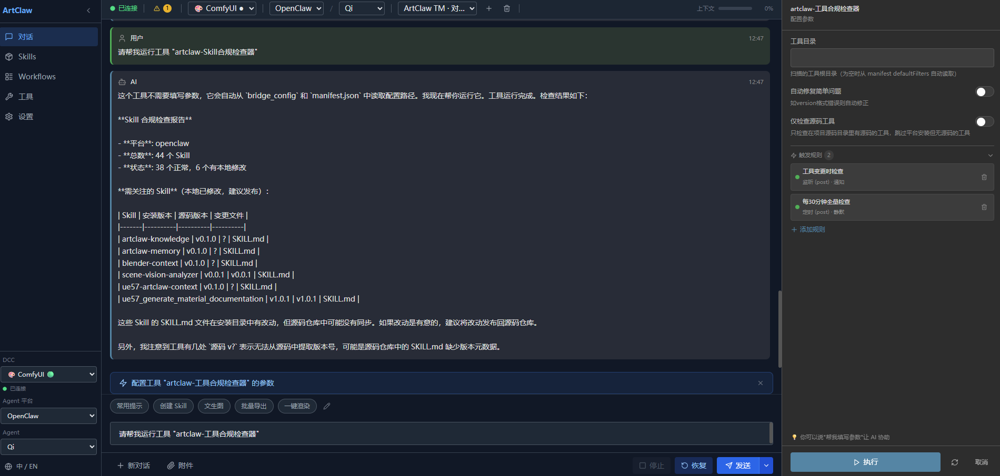
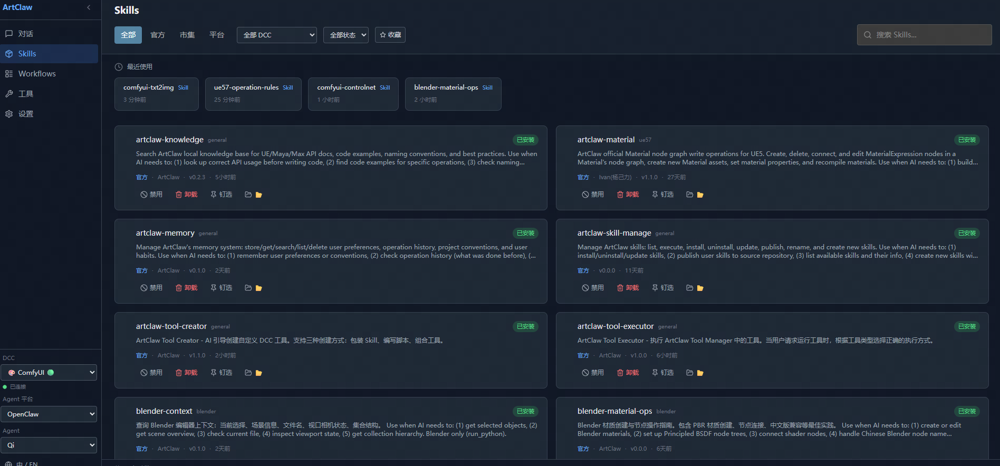
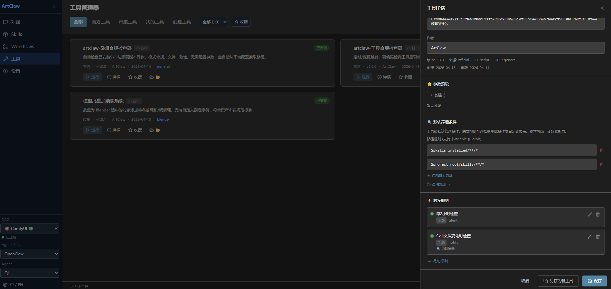

# ArtClaw Bridge

**让 UE引擎、Maya、3ds Max、Blender、Houdini、Substance Painter / Designer、ComfyUI 等 DCC 工具通过 MCP 协议接入 AI Agent 的桥接框架**

ArtClaw Bridge 为 Unreal Engine、Maya、3ds Max、Blender、Houdini、Substance Painter、Substance Designer、ComfyUI 等数字内容创作（DCC）软件提供统一的 AI 桥接层。通过 [MCP (Model Context Protocol)](https://modelcontextprotocol.io/) 协议，AI Agent 可以直接理解和操作编辑器环境。


---

## 🎬 演示

> 以下为实际操作演示，展示了 AI Agent 在编辑器内直接执行任务的效果

**UE 连接 OpenClaw — 编辑器内 AI 对话面板**


**Blender 集成 — AI 在 Blender 编辑器中操作**


**跨 DCC 上下流交接 — AI 驱动工作流**


**Substance Designer & Painter — AI 材质生成工作流**


**Tool Manager — Skill、Tool 管理器**




⭐ *更多演示视频即将上线，敬请关注！*

---

## 项目愿景

在一个框架下做软件和 Agent 桥接，把 AI 能力接入到整个游戏开发的美术流，赋予 Agent 操作软件和解决上下游对接问题的能力。

桥接的好处是**未来可以接各种软件和各种 Agent 平台**，形成通用的软件-Agent 交互层。

---

## ✨ 核心特性

### 🔗 统一 MCP 协议
各 DCC 软件通过标准 MCP 协议与 AI Agent 通信。每个 DCC 只暴露一个 MCP 工具（`run_ue_python` / `run_python`），AI 通过执行 Python 代码完成所有操作，极简且强大。

### 💬 编辑器内 AI 对话面板
在 UE / Maya / Max / Blender / Houdini / SP / SD / ComfyUI 编辑器内直接与 AI 对话，无需切换窗口。功能：
- **流式输出** — AI 回复实时显示，支持 Markdown 渲染
- **Tool 调用可视化** — 折叠卡片展示工具名、参数、执行结果
- **附件发送** — 拖入图片/文件，AI 自动分析
- **上下文长度显示** — 实时 token 使用百分比
- **停止按钮** — 随时中断 AI 执行（发送 `chat.abort` 终止 Agent）

### 🛠️ Skill 管理系统
跨 DCC 分层 Skill 热加载系统：
- **四级优先级** — Official > Marketplace > User > Temporary，高优先级覆盖低优先级
- **编辑器内管理面板** — UE + DCC 统一 UI，支持筛选/搜索/启用/禁用/钉选
- **完整生命周期** — 安装、卸载、更新、发布（版本递增 + git commit）、一键全量同步
- **AI 生成 Skill** — 用自然语言描述需求，AI 自动生成可执行 Skill（manifest + 代码 + 文档）
- **变更检测** — 运行时自动检测未发布变更，智能区分"更新"与"发布"方向
- **钉选 Skill 上下文注入** — 钉选的 Skill 文档自动注入 AI 首条消息上下文

### 🌐 多 Agent 平台支持
配置驱动的平台抽象层 — 在配置中注册新平台后自动出现在 UI：
- **OpenClaw** — 主开发平台，通过 mcp-bridge 插件集成
- **LobsterAI（有道）** — OpenClaw 打包版，Gateway 端口 18790
- **Claude Desktop** — stdio→WebSocket bridge POC
- **编辑器内热切换** — 设置面板一键切换平台，自动断开/重连/刷新 Agent 列表

### 🔄 多会话与 Agent 管理
- **多 Agent 切换** — 设置面板选择 Agent，工具栏显示当前 Agent 信息
- **会话列表管理** — 创建/切换/删除对话，每个 Agent 独立会话缓存
- **会话持久化** — UE 重启后自动恢复上次会话，DCC 实时保存会话状态

### 🧠 记忆管理系统 v2
三层渐进式记忆模型 — AI 记住用户偏好和操作历史：
- **短期**（4h / 200条）→ **中期**（7d / 500条）→ **长期**（永久 / 1000条）
- 语义标签分类（事实/偏好/规范/操作/崩溃/模式）
- 自动晋升、去重、定时维护
- 操作历史追踪与查询

### 📚 本地知识库（RAG）
索引 API 文档和项目文档，语义检索辅助 AI 决策。

### 🛡️ 安全与稳定性
- 事务保护、风险评估、主线程调度
- 共享模块同步校验（`verify_sync.py` 比较 MD5，防止多副本漂移）
- 长任务超时保护 + 主动事件重置

---

## 🎯 支持的引擎、DCC 软件与 Agent 平台

已验证 **OpenClaw + LobsterAI + Unreal Engine 5.7 + Maya 2023 + Blender 5.1 + Substance Painter 11.0.1 + Substance Designer 12.1.0 + ComfyUI**。其他组合理论上兼容但未经测试，欢迎社区反馈。

### 引擎与 DCC 软件

| 软件 | 已验证版本 | 状态 | 插件 | MCP 端口 | 备注 |
|------|----------|------|------|----------|------|
| **Unreal Engine** | 5.7 | ✅ 已验证 | UEClawBridge | 8080 | C++ + Python，Slate UI 对话面板 |
| **Maya** | 2023 | ✅ 已验证 | DCCClawBridge | 8081 | Python 3.9.7 + PySide2，Qt 对话面板 |
| **3ds Max** | — | ⚠️ 未验证 | DCCClawBridge | 8082 | 代码已实现，与 Maya 共用插件，未测试 |
| **Blender** | 5.1 | ✅ 已验证 | DCCClawBridge | 8083 | PySide6 独立 Qt 窗口，bpy.app.timers 驱动 |
| **Houdini** | — | ⚠️ 未验证 | DCCClawBridge | 8084 | 代码已实现，hdefereval 主线程调度，未测试 |
| **Substance Painter** | 11.0.1 | ✅ 已验证 | DCCClawBridge | 8085 | SP 内置 Qt + QTimer 轮询 |
| **Substance Designer** | 12.1.0 | ✅ 已验证 | DCCClawBridge | 8086 | SD 内置 Qt + QTimer 轮询，预注入 sd.api 变量 |
| **ComfyUI** | V0.19.0 | ✅ 已验证 | ComfyUIClawBridge | 8087 | 自定义节点，纯 Python，MCP WS Server，无可见节点 |
| **其他 UE / Maya 版本** | — | ⚠️ 未验证 | — | — | 理论上兼容 UE 5.3+ / Maya 2022+，未测试 |

### Agent 平台

| 平台 | 状态 | 备注 |
|------|------|------|
| **OpenClaw** | ✅ 已验证 | 主开发平台，通过 mcp-bridge 插件集成，全部功能已验证 |
| **LobsterAI（有道）** | ✅ 已验证 | OpenClaw 打包版，Gateway 端口 18790，已验证基础功能 |
| **Claude Desktop** | ⚠️ POC | stdio→WebSocket bridge 概念验证，尚未深度集成 |

---

## 🛠️ 官方 Skills（27个）

### 通用 Skills（3个）
- **artclaw-knowledge** — 项目知识库查询
- **artclaw-memory** — 记忆管理操作
- **artclaw-skill-manage** — Skill 管理操作

### Unreal Engine Skills（6个）
- **ue57-artclaw-context** — 编辑器上下文查询
- **ue57-artclaw-highlight** — 视口高亮
- **ue57-camera-transform** — 相机操作
- **ue57-operation-rules** — UE 操作规范
- **ue57_get_material_nodes** — 材质节点查询
- **ue57_material_node_edit** — 材质节点编辑

### Maya Skills（1个）
- **maya-operation-rules** — Maya 操作规范

### Blender Skills（3个）
- **blender-context** — 编辑器上下文查询
- **blender-operation-rules** — Blender 操作规范
- **blender-viewport-capture** — 视口截图

### 3ds Max Skills（1个）
- **max-operation-rules** — Max 操作规范

### Houdini Skills（4个）
- **houdini-context** — 编辑器上下文查询
- **houdini-node-ops** — 节点操作
- **houdini-operation-rules** — Houdini 操作规范
- **houdini-simulation** — 模拟操作

### Substance Painter Skills（4个）
- **sp-context** — 编辑器上下文查询
- **sp-layer-ops** — 图层操作
- **sp-operation-rules** — SP 操作规范
- **sp-bake-export** — 烘焙与导出

### Substance Designer Skills（4个）
- **sd-context** — 编辑器上下文查询
- **sd-material-recipes** — 材质配方操作
- **sd-node-ops** — 节点操作
- **sd-operation-rules** — SD 操作规范

---

## 🏗️ 系统架构

```
┌──────────────────────────────────────────────────────────────┐
│                         AI Agent (LLM)                        │
│                    OpenClaw / LobsterAI                       │
└──────────────────────────┬───────────────────────────────────┘
                           │ WebSocket（上游：Chat RPC / 下游：MCP Tool Calls）
┌──────────────────────────▼───────────────────────────────────┐
│                        Agent Gateway                          │
│              + MCP Bridge + ArtClawToolManager                │
│      （统一管理 Agent、会话、MCP Server、工具、工作流）          │
└──────────────────────────┬───────────────────────────────────┘
                           │ WebSocket JSON-RPC（MCP）
         ┌─────────────────┼─────────────────┬─────────────────┐
         ▼                 ▼                 ▼                 ▼
    ┌─────────┐       ┌─────────┐       ┌─────────┐       ┌─────────┐
    │   UE    │       │  Maya   │       │ Blender │       │ ComfyUI │
    │  :8080  │       │  :8081  │       │  :8083  │       │  :8087  │
    └────┬────┘       └────┬────┘       └────┬────┘       └────┬────┘
         ▼                 ▼                 ▼                 ▼
      UE API           Maya API          bpy API          ComfyUI API
         │                 │                 │                 │
    ┌─────────┐       ┌─────────┐       ┌─────────┐       ┌─────────┐
    │ 3dsMax  │       │ Houdini │       │   SP    │       │   SD    │
    │  :8082  │       │  :8084  │       │  :8085  │       │  :8086  │
    └─────────┘       └─────────┘       └─────────┘       └─────────┘
```

**双链路通信**：
- **上游（Chat）**：编辑器面板 → Gateway WebSocket RPC → AI Agent
- **下游（Tool Calls）**：AI Agent → Gateway → MCP Bridge → DCC MCP Server → DCC API

每个 DCC 软件运行独立的 MCP Server，通过统一协议向 AI Agent 暴露编辑器能力。Skill 系统、知识库、记忆存储等核心模块跨 DCC 共享。

---

## 🖥️ ArtClawToolManager — 网页管理面板

统一的网页端管理界面，集中管理跨所有 DCC 平台的 Skills、Tools 和 Workflows。

### 功能特点

- **网页端对话面板** — 直接在浏览器中控制 AI Agent，无需安装 DCC 软件
- **Skill 管理** — 浏览、安装、更新和管理所有平台的 Skills
- **工具注册表** — 统一的内容筛选与自动化工具注册表
- **Workflow 管理** — 创建、管理和执行 AI 驱动的工作流模板
- **ComfyUI 集成** — 通过网页界面直接用 AI 控制 ComfyUI
- **跨平台** — 单一面板管理所有已连接的 DCC 软件

### 架构

```
ArtClawToolManager/
├── src/
│   ├── server/           # FastAPI 后端
│   │   └── api/
│   │       ├── skills.py     # Skill 生命周期管理
│   │       ├── tools.py      # 工具注册与执行
│   │       └── workflows.py  # 工作流模板管理
│   └── web/              # 前端（src/）
└── docs/                 # 文档
```

### 使用方式

网页面板连接到与 DCC 插件相同的 Agent Gateway，提供替代界面用于 AI 对话和工具/工作流管理，无需打开 DCC 软件即可使用。

---

## 🔧 工具与工作流架构

为**内容筛选、自动化触发、AI 驱动工作流**设计的统一三层架构：

### 工具层（Tool Layer）
- **注册** — 工具通过标准 manifest 向 ToolManager 注册
- **执行** — 统一 `execute_tool(tool_id, inputs)` API，标准化输入输出
- **筛选** — 内置内容筛选管道（验证 → 筛选 → 转换 → 输出）
- **调度** — Cron 定时和事件触发自动化

### 工作流层（Workflow Layer）
- **模板系统** — 基于 JSON 的工作流模板，支持变量替换
- **链式执行** — 多步骤工作流，依赖解析
- **状态管理** — 跨会话工作流状态持久化
- **AI 集成** — LLM 可通过 `execute_workflow()` API 触发工作流

### 触发层（Trigger Layer）
- **事件驱动** — 文件系统事件、API 调用、消息队列
- **条件逻辑** — 筛选条件、阈值检查、内容验证
- **扇出** — 单触发 → 多工具/工作流执行
- **审计追踪** — 完整执行日志，用于调试和合规

此架构支持强大的自动化场景：
- AI 检测场景变化 → 触发内容验证工作流
- 新资产导入 → 运行自动化 QA 工具
- ComfyUI 生成完成 → 触发下游 DCC 流水线

---

## 📦 项目结构

```
artclaw_bridge/
├── core/                              # 🔧 共享核心模块（安装时复制到各 DCC）
│   ├── bridge_core.py                 #    WebSocket RPC 通信核心
│   ├── bridge_config.py               #    配置加载 & 多平台默认值
│   ├── bridge_dcc.py                 #    DCC 端 Bridge 管理器（Qt 信号槽）
│   ├── memory_core.py                #    记忆管理系统 v2 核心
│   ├── mcp_server.py                 #    MCP Server（DCC 端，含工具事件回调）
│   ├── skill_sync.py                 #    Skill 安装/卸载/同步/发布
│   └── ...                           #    诊断、健康检查、完整性检查等
├── platforms/                         # 🌐 平台桥接层（可替换）
│   ├── openclaw/                     #    OpenClaw 适配器（ws 连接 + chat API + 诊断）
│   ├── lobster/                      #    LobsterAI 配置注入
│   └── claude/                       #    Claude Desktop stdio→WS bridge POC
├── subprojects/                      # 💻 DCC 插件子项目
│   ├── UEDAgentProj/                 #    Unreal Engine 项目
│   │   └── Plugins/UEClawBridge/    #       UE 插件（C++ Slate UI + Python 逻辑）
│   ├── DCCClawBridge/               #    Maya / Max / Blender / Houdini / SP / SD 共享插件
│   │   ├── artclaw_ui/             #       通用 Qt 对话面板 + Skill 管理面板
│   │   ├── adapters/               #       DCC 适配器（Maya / Max / Blender / Houdini / SP / SD）
│   │   ├── core/                   #       核心模块副本（安装时从 core/ 同步）
│   │   ├── maya_setup/             #       Maya 部署文件
│   │   └── max_setup/              #       Max 部署文件
│   ├── ComfyUIClawBridge/           #    ComfyUI 自定义节点（纯 Python MCP Server，无可见节点）
│   └── ArtClawToolManager/          #    🖥️ 网页仪表盘 + 工具/工作流管理
│       ├── src/
│       │   ├── server/api/        #       FastAPI 后端（skills、tools、workflows）
│       │   └── web/src/           #       前端
│       └── docs/                  #       文档
├── skills/                           # 🛠️ Skill 源码仓库
│   ├── official/                    #    官方 Skills（通用 / unreal / maya / max / blender / houdini / SP / SD）
│   ├── marketplace/                 #    市场 Skills
│   └── templates/                   #    Skill 模板（基础 / 高级 / 材质文档）
├── cli/                              # ⌨️ ArtClaw CLI 工具
├── docs/                             # 📚 项目文档（规格 / 功能 / 故障排除）
├── install.bat                       # 📦 一键安装脚本（Windows 交互式菜单，平台选择）
├── install.py                        # 📦 跨平台安装脚本（CLI，--platform openclaw/lobster）
└── verify_sync.py                    # 🔍 共享模块同步校验（MD5 比较，--fix 自动修复）
```

---

## 🚀 安装

### 环境要求

- **Python** 3.9+
- **Agent 平台**（任选其一）：
  - [OpenClaw](https://github.com/openclaw/openclaw)（`npm install -g openclaw`）
  - [LobsterAI](https://lobsterai.com/)（网易有道）
- 目标 DCC 软件（按需选择）：
  - UE 5.7（推荐，理论上兼容 5.3+）
  - Maya 2023（推荐，理论上兼容 2022+）
  - 3ds Max 2024+（未测试）
  - Blender 5.1（已验证，自动安装 PySide6）
  - Houdini（未测试）
  - Substance Painter 11.0.1（已验证）
  - Substance Designer 12.1.0（已验证）
  - ComfyUI（已验证，通过 ComfyUI-Manager 或复制到 custom_nodes 安装）

### 方式一：一键安装（推荐）

```bash
# 1. 克隆仓库
git clone https://github.com/IvanYangYangXi/artclaw_bridge.git
cd artclaw_bridge

# 2a. Windows 交互式菜单 — 双击或在终端运行：
install.bat

# 2b. 或使用 Python CLI：
python install.py --help                                      # 查看所有选项
python install.py --maya                                      # 安装 Maya 插件（默认 2023）
python install.py --maya --maya-version 2024                  # 指定 Maya 版本
python install.py --max --max-version 2024                    # 安装 Max 插件
python install.py --ue --ue-project "C:\项目路径"              # 安装 UE 插件
python install.py --blender --blender-version 5.1             # 安装 Blender 插件（自动安装 PySide6）
python install.py --houdini --houdini-version 20.5            # 安装 Houdini 插件
python install.py --sp                                        # 安装 Substance Painter 插件
python install.py --sd                                        # 安装 Substance Designer 插件
python install.py --comfyui --comfyui-path "C:\ComfyUI"      # 安装 ComfyUI 插件
python install.py --openclaw                                  # 配置 OpenClaw
python install.py --openclaw --platform lobster               # 配置 LobsterAI
python install.py --all --ue-project "C:\项目路径"              # 安装所有 DCC
```

安装脚本会自动：
1. 复制插件文件到目标 DCC 的标准目录
2. 部署 `core/` 共享模块（自包含，无需源码目录）
3. 安装官方 Skills 到平台目录（`~/.openclaw/skills/` 或 LobsterAI 对应目录）
4. **安全处理 startup 文件**（追加模式，不覆盖用户已有内容）
5. 配置 Agent 平台 mcp-bridge 集成
6. 写入 `~/.artclaw/config.json` 项目配置
7. 重复运行安全（幂等）

### 方式二：Agent 安装（AI 用户推荐）

如果你在使用 AI Agent（如 OpenClaw、Claude 或其他支持 MCP 的 Agent），可以通过自然语言对话来安装 ArtClaw Bridge：

**直接告诉你的 Agent：**

> "帮我安装 ArtClaw Bridge。我需要用于 [UE/Maya/Blender/ComfyUI 等]，项目路径是 [路径]。"

Agent 会自动完成：
1. 克隆仓库到你的工作区
2. 运行相应的安装命令
3. 为你的 Agent 平台配置 MCP bridge
4. 验证安装是否成功

**示例指令：**
- *"为 Unreal Engine 5.7 安装 ArtClaw Bridge，我的项目在 D:\\MyProject\\UE_Game"*
- *"给 Maya 2023 和 Blender 5.1 配置 ArtClaw Bridge"*
- *"为 ComfyUI 安装 ArtClaw Bridge，路径是 C:\\ComfyUI"*
- *"安装 ArtClaw Bridge，支持所有 DCC 软件"*

Agent 会处理所有技术细节 —— 克隆、依赖安装、路径配置和 MCP 设置。

### 安装后验证

| DCC | 验证步骤 |
|-----|---------|
| **UE** | 打开项目 → 启用 "UE Claw Bridge" 插件 → 重启 → Window → UE Claw Bridge → Connect |
| **Maya** | 启动 Maya → 菜单栏出现 **ArtClaw** → 打开对话面板 → Connect |
| **3ds Max** | 启动 Max → ArtClaw 自动加载 → 菜单栏 ArtClaw → 对话面板 → Connect |
| **Blender** | 启动 Blender → Edit → Preferences → Add-ons → 启用 ArtClaw Bridge → 侧栏 ArtClaw → Start Bridge |
| **Houdini** | 启动 Houdini → Shelf → ArtClaw → Start Bridge |
| **SP** | 启动 Substance Painter → Python → artclaw → start_plugin → 对话面板 |
| **SD** | 启动 Substance Designer → Python → artclaw → start_plugin → 对话面板 |
| **ComfyUI** | 启动 ComfyUI → 查看控制台是否有 "ArtClaw: ComfyUI Bridge 启动中..." → 网页面板检测到连接 |

### 卸载

```bash
python install.py --uninstall --maya                            # 卸载 Maya 插件
python install.py --uninstall --ue --ue-project "C:\项目"          # 卸载 UE 插件
python install.py --uninstall --blender --blender-version 5.1     # 卸载 Blender 插件
python install.py --uninstall --sp                                # 卸载 Substance Painter 插件
python install.py --uninstall --sd                                # 卸载 Substance Designer 插件
python install.py --uninstall --comfyui --comfyui-path "C:\ComfyUI" # 卸载 ComfyUI 插件
```

卸载脚本会删除插件目录，并**只移除 ArtClaw 代码块**（不影响用户已有内容）。

---

## 🛠️ Skill 系统

### 目录结构

```
项目源码（开发时）：                    已安装（运行时）：
skills/                               ~/.openclaw/skills/
├── official/                          ├── ue57-camera-transform/
│   ├── universal/                     ├── ue57-artclaw-context/
│   │   ├── artclaw-memory/             ├── artclaw-memory/
│   │   └── scene-vision-analyzer/      ├── scene-vision-analyzer/
│   ├── unreal/                         ├── maya-operation-rules/
│   │   ├── ue57-camera-transform/      ├── blender-operation-rules/
│   │   └── ue57-operation-rules/        ├── sp-operation-rules/
│   ├── maya/                           ├── sd-operation-rules/
│   │   └── maya-operation-rules/       └── ...
│   ├── max/
│   │   └── max-operation-rules/
│   ├── blender/
│   │   ├── blender-operation-rules/
│   │   ├── blender-context/
│   │   └── blender-viewport-capture/
│   ├── houdini/
│   │   ├── houdini-operation-rules/
│   │   ├── houdini-context/
│   │   ├── houdini-node-ops/
│   │   └── houdini-simulation/
│   ├── substance_painter/
│   │   ├── sp-operation-rules/
│   │   ├── sp-context/
│   │   ├── sp-layer-ops/
│   │   └── sp-bake-export/
│   └── substance_designer/
│       ├── sd-operation-rules/
│       ├── sd-context/
│       ├── sd-node-ops/
│       └── sd-material-recipes/
├── marketplace/
│   └── universal/
│       └── ...
└── templates/
```

**工作流**：编辑安装目录 → `发布`（安装目录→源码 + 版本递增 + git commit）→ `更新`（源码→安装目录）

### 创建 Skills

直接在编辑器中用自然语言描述：

> "帮我创建一个 Skill，可以批量重命名选中的 Actor，给它们加上指定前缀"

AI 会自动生成 `SKILL.md` + `manifest.json` + `__init__.py`，确认后即可使用。

---

## 🤝 贡献

欢迎提交 Issue 和 Pull Request！特别期待以下贡献：

- 🔌 **新 DCC 桥接实现** — 支持更多 DCC 软件
- 🛠️ **新 Skills** — 为各种 DCC 编写的实用 Skills（当前有 UE / Maya / Max / Blender / Houdini / SP / SD / ComfyUI 官方 Skills）
- 🧪 **测试反馈** — 在未验证的 DCC 版本上测试并报告
- 📖 **文档** — 使用教程、最佳实践

### 贡献流程

1. Fork 本仓库
2. 创建功能分支：`git checkout -b feat/my-feature`
3. 提交更改：`git commit -m "feat: add my feature"`
4. 推送并创建 PR

详情见[贡献指南](docs/skills/CONTRIBUTING.md)。

---

## 📖 文档

- **[系统架构设计](docs/specs/系统架构设计.md)** — 整体架构与设计原则
- **[Skill 开发指南](docs/skills/SKILL_DEVELOPMENT_GUIDE.md)** — 编写自定义 Skills
- **[Skill 规范说明](docs/skills/MANIFEST_SPEC.md)** — manifest.json 格式规范
- **[代码规范](docs/specs/代码规范.md)** — 项目编码规范
- **[多平台兼容设计方案](docs/UEClawBridge/features/多平台兼容设计方案.md)** — 平台抽象层设计
- **[DCCClawBridge](subprojects/DCCClawBridge/README.md)** — Maya / Max / Blender / Houdini / SP / SD 插件详情
- **[ComfyUIClawBridge](subprojects/ComfyUIClawBridge/__init__.py)** — ComfyUI 插件详情
- **[贡献指南](docs/skills/CONTRIBUTING.md)** — 如何贡献

---

## 🧾 一些思考（未必正确，欢迎指正）

### 为什么不是直接构建一个接入 LLM 的 Agent？

Agent 平台是大工程。很多公司都在做自己的 Agent 管理平台，LobsterAI 就是其中之一。

这个项目只解决**目前需要的工程问题**，专注于软件桥接这个细分领域。

### 有 MCP 和 Skills 就能接 LLM，为什么还要做这个桥接项目？

目标是优化用户体验。就像 VSCode 有很多 Agent 插件，让用户在原来的软件窗口里工作 —— 大大提高了使用意愿和效率，也能基于需求做定制开发。

### 关于生产环境部署

对于按照明确规则批量生成物件这类简单任务，可以直接通过 MCP 完成。性能优化分析、脚本开发等通过代码执行能做到的事情也完全可行。但这些用例主要针对 TA 和程序员，对艺术家完全没有帮助。

现在的收益是艺术家可以直接让 AI 帮忙做简单的脚本化功能，不用学编程。

LLM 直接执行的过程是个黑盒，不知道内部怎么跑，执行结果完全不可控。就像早期的 AI 生图 —— AI 能画，但没法部署到项目里。后来出现了很多工程工具让 AI 的执行过程可控，这才真正提高了生产效率。

所以下一步要做的是拆解过程，让 AI 的输出可控。这依然要靠传统的工程思维。Claude Code 的代码也验证了这个方向是对的 —— 他们没有很多黑魔法，而是通过工程手段让 LLM 以正确、可控的方式执行。

---

## 📄 许可证

本项目采用 [MIT 许可证](LICENSE)。

## 👤 作者

**Ivan（杨吉力）** — [@IvanYangYangXi](https://github.com/IvanYangYangXi)

---

## ☕ 支持这个项目

如果 ArtClaw Bridge 对你的工作有帮助，可以请作者喝杯咖啡 ☕

[](https://github.com/sponsors/IvanYangYangXi)

你的支持是持续开发和维护的最大动力！🚀
