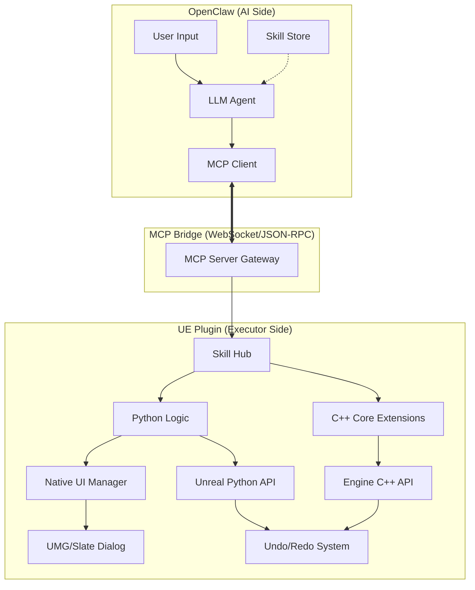

# UE Editor Agent 系统架构设计 (System Architecture Design)

## 1. 逻辑架构分层 (Layered Architecture)

本系统采用 **“云端/本地大脑 + 边缘执行器”** 的分布式架构，通过 **MCP 协议** 实现解耦。

### 1.1 感知与决策层 (Intelligence Layer - OpenClaw)
*   **LLM Engine**: 负责理解自然语言，拆解任务步骤。
*   **MCP Client**: 实时维护从 UE 端拉取的工具清单（Tools）和场景状态（Resources）。
*   **Skill Manager**: 存储复杂的业务逻辑模板（如“自动化灯光布置”的 Prompt 和步骤引导）。

### 1.2 通信协议层 (Communication Layer - MCP)
*   **Transport**: 基于 **WebSocket** (用于实时双向交互) 或 **Stdio** (用于本地快速调用)。
*   **Protocol**: 遵循 [MCP 1.0 规范](https://modelcontextprotocol.io)，使用 JSON-RPC 2.0 进行封装。
*   **Schema Registry**: 动态管理 Python 装饰器自动生成的 API 描述文档。

### 1.3 核心执行层 (Execution Layer - UE Plugin)
*   **MCP Server**: 驻留在 UE 进程内的服务器，负责接收指令并分发。
*   **Skill Hub (热加载器)**: 动态监听 `Plugins/UEAgent/Skills` 目录，管理 Python 模块的生命周期（Load/Unload/Reload）。
*   **Native UI Bridge**: 负责唤起 Slate 或 UMG 对话框，处理 AI 操作的人机确认。

### 1.4 底层能力层 (Capability Layer - Engine)
*   **Python Wrapper**: 封装高频 `unreal` API，提供简化的业务接口。
*   **C++ Extension**: 针对 Python 无法触及的底层（如原生 RHI 操作、自定义 Shader 属性修改）提供扩展。
*   **Transaction Guard**: 深度钩入 UE 的 `Undo/Redo` 系统，确保 AI 每一步操作都有据可查。

---

## 2. 系统组件图 (Component Diagram)

---

## 3. 关键业务流程 (Sequence Diagram)

### 以“将所有选中模型设为红色材质”为例：

1.  **用户**: 在对话框输入“把选中的东西都变红”。
2.  **OpenClaw**: 
    *   调用 MCP Resource `unreal://selected_actors` 获取当前选中的物体。
    *   匹配到 Skill 中的 `Material_Swapper` 逻辑。
    *   通过 MCP Tool `set_material_parameter` 发送指令。
3.  **UE 插件**:
    *   **Skill Hub** 定位到对应的 Python 函数。
    *   **Native UI** 弹出气泡确认：“AI 计划修改 5 个 Actor，是否继续？”。
    *   **Core Executor** 开启一个 `ScopedTransaction`。
    *   **Python** 执行 `unreal.EditorAssetLibrary.load_asset` 并应用材质。
4.  **反馈**: 执行结果通过 MCP 回传，AI 回复“修改完成，按 Ctrl+Z 可撤销”。

---

## 4. 技术栈选择 (Tech Stack)

| 维度 | 技术选型 | 原因 |
| :--- | :--- | :--- |
| **通讯协议** | **MCP (JSON-RPC)** | 跨语言标准，生态兼容性强 |
| **中间件** | **WebSocket (Python-SocketIO)** | 满足 UE 编辑器与外部 Agent 的实时双向推送 |
| **逻辑语言** | **Python 3.9+ (UE Internal)** | 迭代速度快，生态丰富，支持 inspect 自动映射 |
| **底层性能** | **C++ (Slate/RHI)** | 补齐 Python 在 UI 和底层渲染数据操作上的短板 |
| **配置管理** | **JSON / YAML** | 方便 Skill 模块的跨平台分发与人类阅读 |

---

