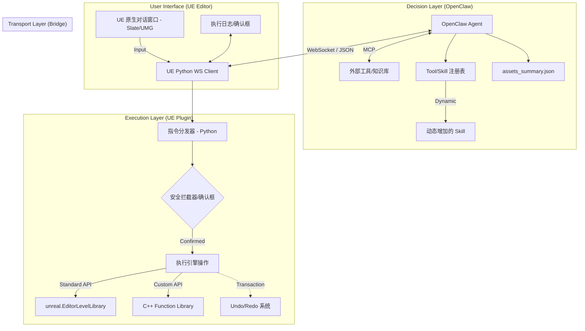

# UE Editor Agent 插件系统架构设计与开发路线图 (SDD v0.4)

## 1. 详细架构设计 (Detailed Architecture)

本系统采用“大脑-中转-执行”的三层解耦架构，并引入了安全拦截、资产预索引及动态 MCP 工具挂载机制。

### 1.1 系统架构图 (System Topology)

### 1.2 核心机制说明
- **UE 原生对话交互**: 在虚幻引擎内部集成基于 Slate 或 WebBrowser 的侧边栏窗口，开发者无需切换窗口即可直接输入指令并查看 AI 回馈。
- **动态 Skill 扩展**: 开发者可以通过自然语言描述（如“以后帮我把模型放大两倍并放在地面上”）来实时生成新的工具逻辑（Python 脚本或 OpenClaw Tool）。
- **MCP 挂载支持**: 支持 [Model Context Protocol](https://modelcontextprotocol.io)，允许 Agent 挂载外部工具服务器（如连接到项目的文档库、外部 API 或特定的 DCC 工具）。
- **分发与共享**: 
  - **UE 插件**: 采用模块化结构，支持作为 `Plugins` 目录直接拷贝发布。
  - **OpenClaw 插件**: 通过 TypeScript 编写并打包为标准的 OpenClaw Plugin 格式。
- **安全确认步 (Confirmation Step)**: 
  - **逻辑**: 当 OpenClaw 发出高风险指令（如 `delete_actor`, `clear_level`, `bulk_modify`）时，插件会在 UE 编辑器内弹出模态对话框。
  - **目的**: 防止 LLM 误操作导致场景损毁，将最终执行权保留在开发者手中。
- **资产预索引 (Asset Pre-indexing)**:
  - **逻辑**: 插件在启动或手动刷新时，利用 `AssetRegistry` 扫描常用资产（StaticMesh, Material 等），生成精简的 `assets_summary.json`。
  - **目的**: 仅向 OpenClaw 推送资产简称与路径映射，避免将全量原始数据塞入上下文，节省 Token 并提高匹配精度。

### 1.3 核心组件职责定义 (Core Component Responsibilities)

本系统通过明确的职责分工，实现了从“自然语言理解”到“引擎底层执行”的完整闭环。

#### 1.3.1 决策层 (OpenClaw Agent)
*   **语义解析与意图识别**: 将用户的自然语言指令拆解为可执行的原子操作（Atomic Actions）。
- **工具编排 (Orchestration)**: 根据上下文决定调用 UE 内部工具还是外部 MCP 工具。
- **上下文维护**: 记忆当前的场景状态（如已选中物体、最近操作），确保多轮对话的一致性。
- **MCP 客户端**: 负责挂载和管理外部标准化的 MCP 协议服务器，扩展 Agent 的知识库与外部 API 调用能力。

#### 1.3.2. 通讯层 (WebSocket Bridge)
- **全双工通讯**: 维持 OpenClaw 与 UE 进程间的低延迟长连接。
- **协议封包/解包**: 负责将结构化的 JSON 指令封装为标准的通讯帧，并处理心跳检测与断线重连。
- **异步调度**: 在 UE 侧使用独立线程处理网络 IO，避免阻塞编辑器主线程。

#### 1.3.3 执行层 (UE Plugin - Python & C++)

##### 3.1 指令分发器 (Python Dispatcher)
- **主线程注入**: 核心职责是将网络线程收到的指令，安全地分发到 UE 的主渲染线程执行。
- **动态 Skill 加载**: 负责即时解析 LLM 生成的 Python 代码片断，并动态注册为新的可用工具。
- **事务生命周期管理**: 自动开启和关闭 `ScopedEditorTransaction`，确保所有操作可被撤销。

##### 3.2 底层功能库 (C++ Library)
- **像素级数据操作**: 负责 Python 无法高效处理的贴图 Raw Data 读写、通道合并与提取。
- **性能补丁**: 提供高性能的场景扫描及大规模物体批处理接口。
- **反射暴露**: 将底层接口通过 `UFUNCTION` 暴露给 Python 驱动层。

##### 3.3 资产预索引器 (Asset Indexer)
- **摘要生成**: 扫描 `AssetRegistry`，提取常用资产的简称、路径和类型。
- **增量更新**: 监听项目内容变动，及时更新并同步 `assets_summary.json` 给 OpenClaw。

#### 1.4. 交互与安全层 (UI & Safety)

##### 1.4.1 原生对话窗口 (Slate/UMG UI)
- **用户输入终端**: 提供原生质感的对话框，支持文字输入与执行进度显示。
- **Skill 管理界面**: 展示当前 Agent 已挂载的工具列表及 MCP 状态。

##### 1.4.2 安全拦截器 (Safety Interceptor)
- **风险评估**: 预判指令的影响范围（如删除资产数、影响 Actor 数）。
- **交互确认**: 在执行高危操作前强制弹出模态对话框，获取开发者的二次授权。
- **异常捕获**: 捕获执行过程中的报错，并将其转化为 AI 可读的反馈信息，触发自愈流程。

---

## 2. 关键技术选型 (Key Selections)

| 维度 | 选型方案 | 核心理由 |
| :--- | :--- | :--- |
| **UE UI 界面** | **Slate / UMG** | 确保与编辑器原生视觉统一，支持 Docking 停靠在视口侧边。 |
| **能力扩展** | **MCP (Model Context Protocol)** | 行业标准协议，方便跨平台工具集成和上下文共享。 |
| **动态 Skill** | **Python Runtime Exec** | LLM 生成 Python 代码片断，通过插件动态注册到 Dispatcher。 |
| **打包发布** | **UE Plugin Structure** | 包含 Content 与 Source 的标准插件包，方便社区和团队内部分发。 |
| **通讯协议** | **WebSocket** | 全双工通信，支持指令下发与执行状态（含安全反馈）实时回传。 |
| **执行载体** | **UE Python API** | 迭代速度快，无需频繁编译，官方对编辑器自动化支持最完善。 |
| **底层补丁** | **C++ Subsystem** | 挂载于 `UEditorSubsystem`，确保插件随编辑器启动并支持底层接口封装。 |
| **任务安全** | **Slate Post Tick** | 利用 register_slate_post_tick_callback 确保 AI 指令在主线程执行，避免操作 UObject 导致崩溃。 |
| **性能优化** | **Asset Summary** | 通过本地预过滤，减少大模型感知负担，提升指令生成成功率。 |

---

## 3. 开发路线图 (Roadmap)

### 阶段 1：通讯、资产与 UI 原型 (Infrastructure & UI)
*   **核心目标**: 打通双向链路，建立编辑器内对话界面。
*   **关键任务**:
    - [ ] 搭建支持 WebSocket 的 UE 插件骨架。
    - [ ] **UI 开发**: 实现一个支持多轮对话的 UE 编辑器停靠窗口（Dockable Tab）。
    - [ ] **资产扫描**: 生成 `assets_summary.json` 推送到 OpenClaw。
*   **交付物**: 可以在 UE 窗口内与 OpenClaw 聊天。

### 阶段 2：场景操控、安全与 MCP 引入 (Actions & MCP)
*   **核心目标**: 实现基础操作与标准化工具接入。
*   **关键任务**:
    - [ ] 封装基础指令集（Spawn/Transform/Delete）。
    - [ ] **安全拦截**: 实现高风险操作的 UI 确认逻辑。
    - [ ] **MCP 集成**: 在 OpenClaw 侧实现 MCP Client 接口。
*   **交付物**: AI 可操作场景，并能通过 MCP 协议获取外部知识。

### 阶段 3：动态 Skill 与 C++ 性能补丁 (Self-Evolution)
*   **核心目标**: 实现 Agent 的自我能力扩张。
*   **关键任务**:
    - [ ] **动态 Skill**: 实现通过对话生成 Python 脚本并即时加载为新 Tool 的流程。
    - [ ] **C++ 扩展**: 编写贴图/渲染层的高效 C++ 接口并暴露给动态 Skill。
*   **交付物**: 开发者可以口头教 Agent “学会”新操作。

### 阶段 4：发布优化与闭环 (Optimization & Release)
*   **核心目标**: 优化体验并准备分发。
*   **关键任务**:
    - [ ] **分发优化**: 清理依赖，确保插件在不同版本 UE 下的兼容性。
    - [ ] **自愈与快照**: 完善报错自动修正和实时场景上下文同步。
*   **交付物**: 完整的、可分发的 UE Agent 插件包。

---

## 4. 后续关键节点 (Next Steps)

1. **UE 界面技术确认**: 选择纯 Slate C++ 编写还是通过 UMG/WebUI 实现对话框。
2. **MCP 工具定义**: 预选几个首批需要挂载的外部 MCP 工具（如文档检索）。

==================================================
==================================================

## 3. 开发路线图 (Roadmap)

### 阶段 1：通讯原型与基础环境 (Infrastructure)
*   **核心目标**：打通 OpenClaw 与 UE 的双向链路。
*   **关键任务**：
    - [ ] 创建 UE 插件骨架及 Python 脚本运行目录。
    - [ ] 编写 Python 异步 WebSocket 客户端（基于 `threading`）。
    - [ ] OpenClaw 侧创建基础的 UE_Agent 插件，定义 `ue_log_message` 工具进行链路测试。
*   **交付物**：OpenClaw 指令可直接在 UE 视口打印 Log。

### 阶段 2：场景操控与事务管理 (Core Actions)
*   **核心目标**：实现 AI 对场景物体的基础增删改查。
*   **关键任务**：
    - [ ] 封装 Python 指令：`spawn_actor`, `set_transform`, `delete_actor`。
    - [ ] **事务管理**：集成 `unreal.ScopedEditorTransaction` 实现撤销/重做。
    - [ ] **资产同步**：实现 Asset Registry 扫描工具，同步模型库索引给 AI。
*   **交付物**：AI 可根据描述自动布置关卡，且操作可被 Ctrl+Z 撤销。

### 阶段 3：C++ 底层能力增强 (Deep Control)
*   **核心目标**：突破 Python 限制，操作贴图通道与材质。
*   **关键任务**：
    - [ ] 编写 C++ 插件层，暴露贴图像素读写接口。
    - [ ] 实现材质参数批量调整逻辑。
    - [ ] 在 Python 指令集中增加 `modify_texture_channel` 接口。
*   **交付物**：AI 可自动化处理贴图映射及通道合并逻辑。

### 阶段 4：感知与闭环优化 (Intelligence)
*   **核心目标**：提升 AI 的“空间感知”与自愈能力。
*   **关键任务**：
    - [ ] **场景快照**：定期将视口内物体清单同步给 OpenClaw 维持上下文。
    - [ ] **错误自愈**：将 Python 异常信息回传 AI，由 AI 自动修正指令并重试。
    - [ ] **UE UI 集成**：嵌入简易对话窗口，实现编辑器内直接唤起 Agent。
*   **交付物**：一个具备完整感知与执行能力的 UE 智能助手。

---

## 4. 后续关键节点 (Next Steps)

1. **协议原型制定**：确定通用的 JSON 协议格式。
2. **线程模型验证**：测试网络线程与主线程数据投递的稳定性。
